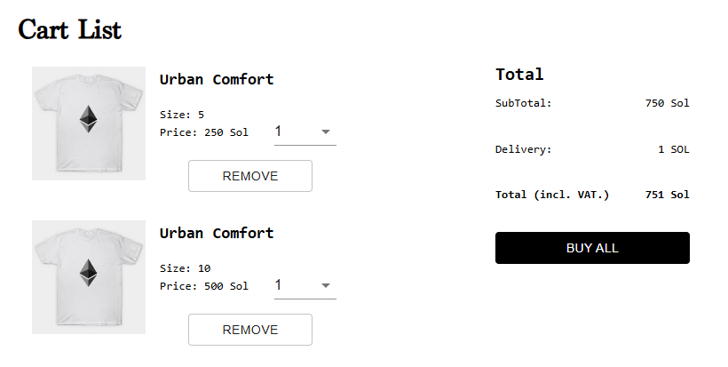
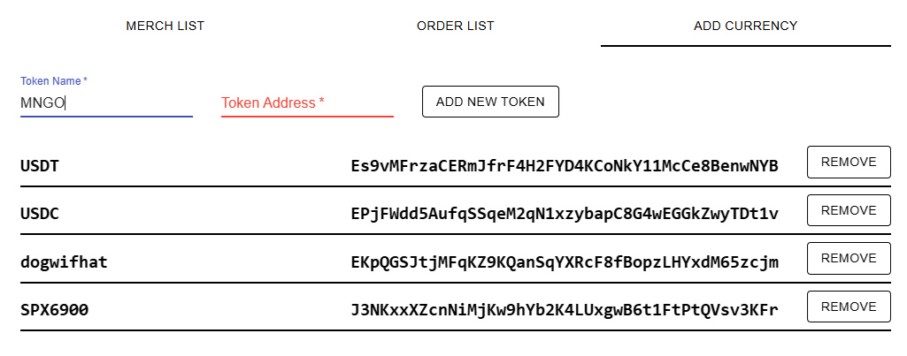

## WEB3 TASK (LEVEL A)

### Task 1

Modify the code to enhance the user experience on the cart page by disabling the [BUY ALL] button when the balance is insufficient.

Skills: Web3.js, React.js

##

### Task 2

Modify the code to ensure that the token name is automatically refreshed when a token address is entered while adding a new currency on the admin site.

Skills: Web3.js, React.js

